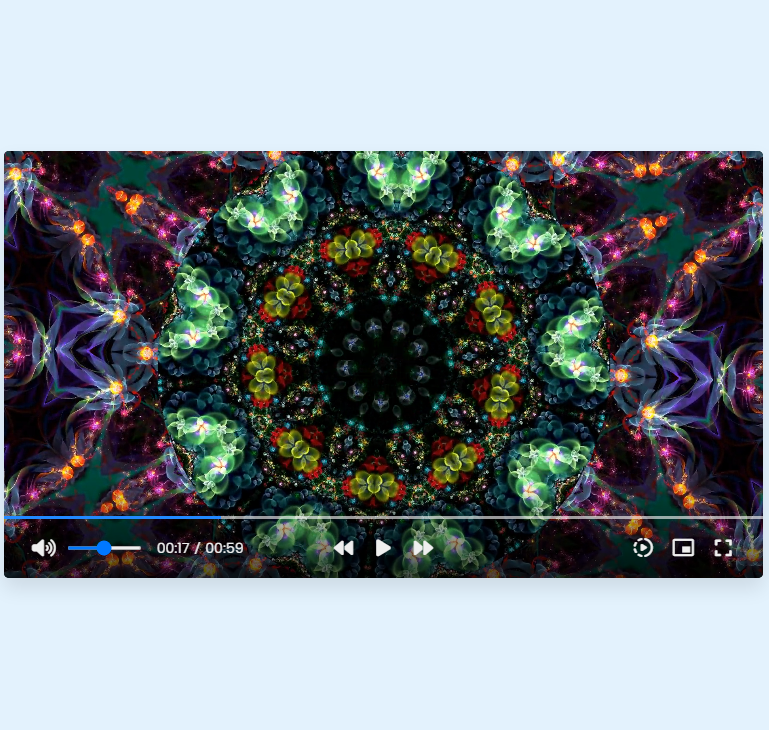

# Custom-video-player

# Welcome to the repo 😃

This app is a custom video player which you can add to your website, project or web page.

Simple and functional.

## Technologies

Built with `HTML, CSS, JavaScript`.

## How to use

Feel free to clone the repo into your VSC (Visual Studio Code).

Once you clone it, go to the index.html file and open the project with live server.

## Editable

You can absolutely make your own improvments to the code and make it much more better 😁

**HAPPY CODING 👋🏻**
